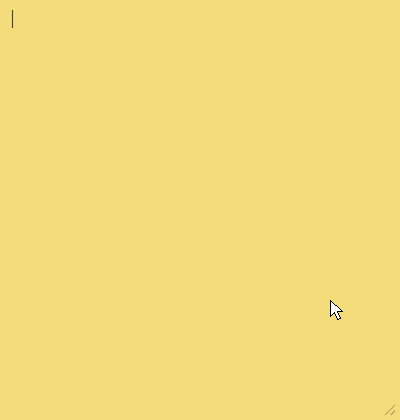

# ddakji

Markdown sticky notes for Windows.

마크다운 기반 위젯형 스티키 노트. Win11 Sticky Notes를 대체하면서
라이브 마크다운 편집 · 모음집(그룹) · 이미지 · 테마를 지원합니다.

## 기능

- 노트별 독립 위젯 창 (프레임 없음, 노트별 항상-위 고정)
- 라이브 마크다운 편집: 문법을 타이핑하면 즉시 렌더, 서식 단축키·하단 서식 바
- 체크박스(클릭 토글)·중첩 목록(Tab)·GFM 표(좁은 창은 표만 가로 스크롤), 이미지 붙여넣기/드롭/드래그 재배치
- 기존 `.md` 파일 가져오기(다중 선택), 마크다운 텍스트 붙여넣으면 서식 적용
- **모음집**: 관련 노트를 묶어 한 창에서 넘겨보기 — 드래그로 합치기, Alt+←→/화살표/점 인디케이터
- 배경색 7종·노트별 폰트(설치 폰트 조회), 시스템 다크/라이트 추종, 반투명 글라스 창
- 노트 목록(모음집 섹션·상대시간·자세히 보기), 검색, 설정(저장 위치 변경 포함)
- Alt-Tab·작업표시줄에는 앱 항목 하나만 — 선택하면 모든 노트 표시, 썸네일은 최근 노트
- 자동 저장, 트레이 상주, 부팅 시 시작, 단축키(Ctrl+N/W/L 등)

## 설치 (Windows)

[Releases](../../releases)에서 최신 `ddakji_x.y.z_x64-setup.exe`(설치형) 또는
`ddakji-x.y.z-portable-x64.zip`(포터블) 다운로드 후 실행.

## 사용법

**[docs/usage.md](docs/usage.md)** — 툴바·서식 바, 마크다운 입력 문법, 단축키, 이미지, 설정 안내.

## 개발

`main`이 안정(릴리스) 브랜치, `develop`이 개발 브랜치입니다. PR은 develop 기준으로 보내주세요.

    npm install
    npm run tauri dev     # 앱 실행
    npm test              # 프론트 테스트
    cargo test --manifest-path src-tauri/Cargo.toml   # Rust 테스트

기여 방법·확인 명령·코드 방향은 **[CONTRIBUTING.md](CONTRIBUTING.md)**,
버전별 변경은 **[CHANGELOG.md](CHANGELOG.md)**를 봐주세요.

## 데이터 위치

`%APPDATA%/Ddakji/notes/*.md` — 평문 마크다운 + YAML 프론트매터.
파일명은 생성 시각 기반(`20260805-134024-a1b2c3.md`), 이미지는 `assets/<노트id>/`에 원본 저장.
저장 위치는 설정에서 변경할 수 있습니다.

## 스택

Tauri 2 · React · TypeScript · TipTap

## 데모

라이브 마크다운 편집 · 체크박스 · 색상 변경:

